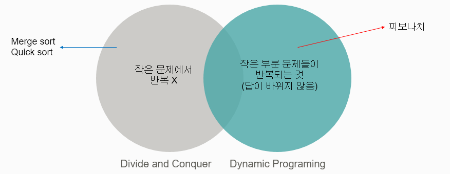
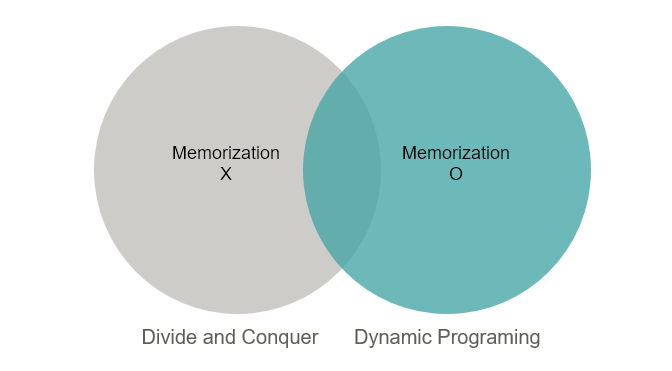
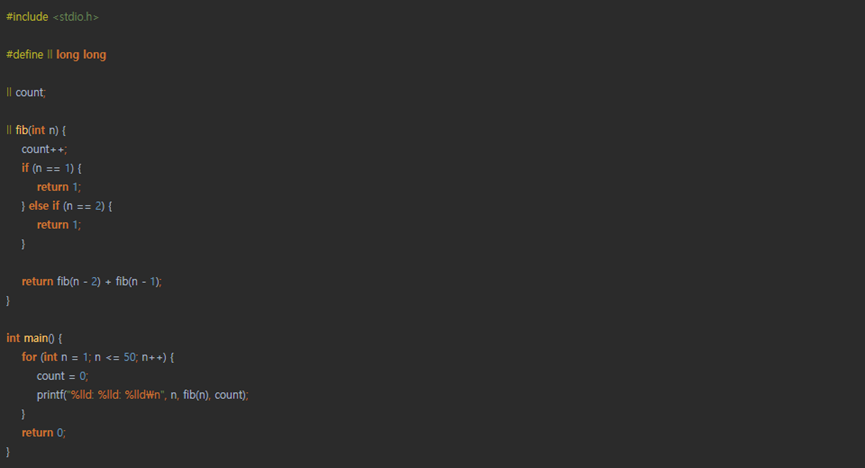
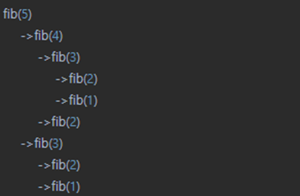
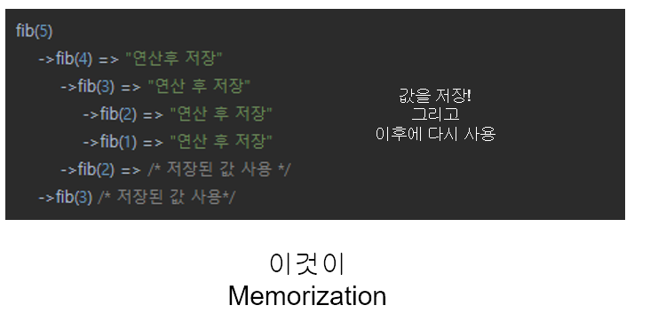
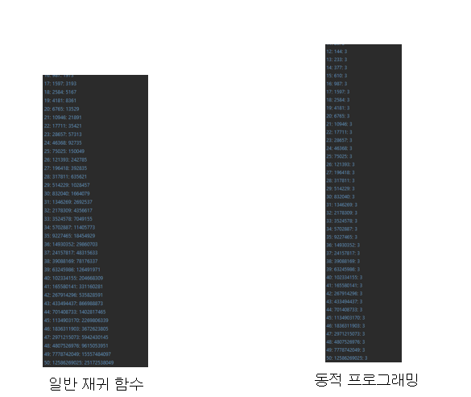
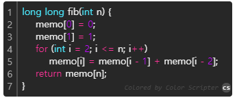
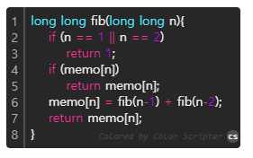

# 정의
## Dynamic Programming
> 큰 문제를 작은 문제로 나누어 푸는 문제를 일컫는 말

(이름을 이렇게 지은 이유: 그냥 멋져서...)

 
 

# 분할정복과 차이점

 
 

# 원리

> 피보나치의 예

다음과 같이 작성할 경우, 50항을 예시로 250억 번 연산을 시행
시간 복잡도는 매 노드가 2가지 분기를 만들기 때문에 O(n^2)

5항을 구할 때도 9번이나 연산이 필요하다

하지만 연산 속에서 중복이 보인다..?

 

## 메모이제이션

 
 

## 효율성 비교

 
 

# 구현 방법

## Bottom UP
> 작은 문제부터 차례로 풀어 나간다
> 
> 반복문으로 구현
> 
> 소스의 가독성이 증가
> 
> 작성이 어려움

 
 

## Top Down
> 큰문제를 작은 문제로 쪼개면서 풀어 나간다
> 
> 재귀로 구현
> 
> 풀기 쉽다
> 
> 가독성 저하

