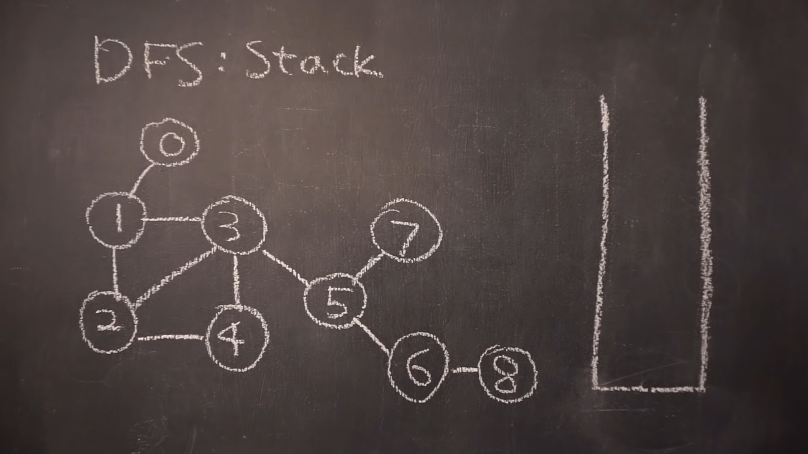
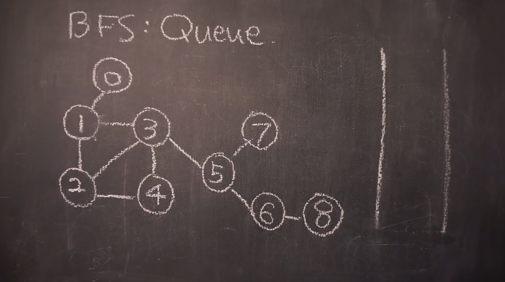
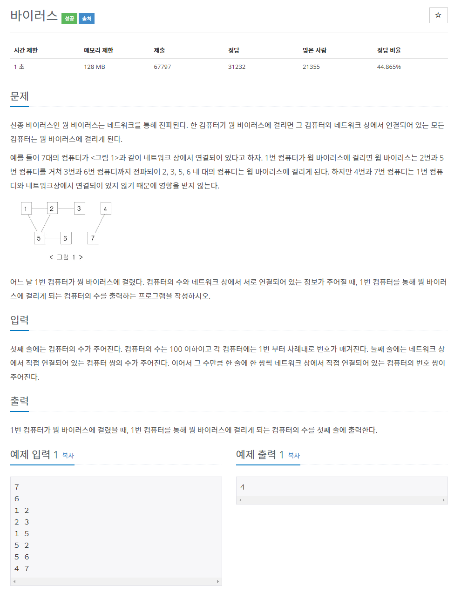

# 정의
## DFS
> Depth-First Search
> 
> 깊이 우선 탐색

## BFS
> Breadth-First Search
>
> 너비 우선 탐색 

<br>
<br>

# 원리


<br>
<br>

## DFS 이동 순서
> 전위(Root - Left - Right): 0 - 1 - 3 - 4 - 2 - 5 - 6
> 
> 중위(Left - Root - Right): 3 - 1 - 4 - 0 - 5 - 2 - 6
> 
> 후위(Left - Right - Root): 3 - 4 - 1 - 5 - 6 - 2 - 0

<br>

## BFS 이동 순서
> 레벨: 0 - 1 - 2 - 3 - 4 - 5 - 6


<br>
<br>

# 자료구조

<br>

## Stack

> **후입선출**


<br>
<br>

## Queue

> 선입선출

<br>


<br>
<br>
<br>

# 알고리즘



<br>
<br>

## DFS: stack
> 1. 스택 만들기
> 2. 시작 노드를 스택에 넣기
> 3. 스택에 노드가 들어간 적 있는지 검사
> 4. 반복문
> 5. 스택에서 노드를 하나 꺼내고 출력
> 6. 자식 노드에 대해 스택에 노드가 들어간 적 있는지 검사
> 7. 꺼낸 노드의 차일드 노드를 스택에 다 넣기
> 8. 스택이 비었으면 반복 종료

<br>
<br>



<br>
<br>

## BFS: Queue
> 1. 큐 만들기
> 2. 시작 노드를 큐에 넣기
> 3. 큐에 노드가 들어간 적 있는지 검사
> 4. 큐에서 노드를 하나 꺼내고 출력
> 5. 자식 노드에 대해 큐에 노드가 들어간 적 있는지 검사
> 6. 꺼낸 노드의 자식 노드를 큐에 다 넣기
> 7. 큐가 비었으면 종료

<br>

*주의 사항*

한 번 스택에 들어간 노드는 다시 들어가지 않음

<br>
<br>

# 구현
```
static ArrayList<Integer>[] node;
  static boolean check[];

  static void bfs(int a) {
    Queue<Integer> queue = new LinkedList<Integer>();
    queue.add(a);
    check[a] = true;

    while(!queue.isEmpty()) {
      int x = queue.poll();
      System.out.print(x + " ");
      for(int y : node[x]) {
        if(!check[y]) {
          check[y] = true;
          queue.add(y);
        }
      }
    }
  }

  static void dfs(int a) {
    if(check[a]) return;

    check[a] = true;
    System.out.print(a + " ");
    for(int y : node[a])
      if(!check[y])
        dfs(y);
  }
```

<br>
<br>
<br>

# 예제
[백준 2606번 바이러스](https://www.acmicpc.net/problem/2606) (실버 3)

<br>



<br>
<br>

## 풀이

할까말까?